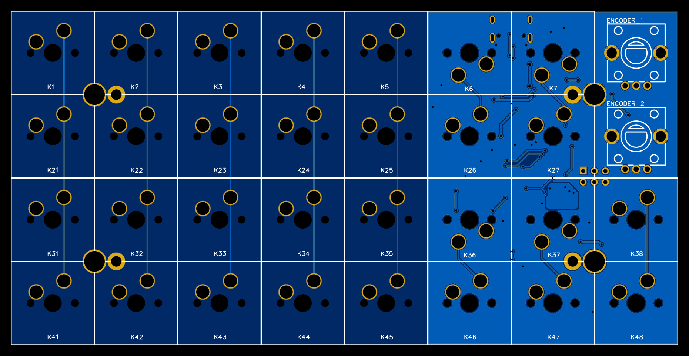
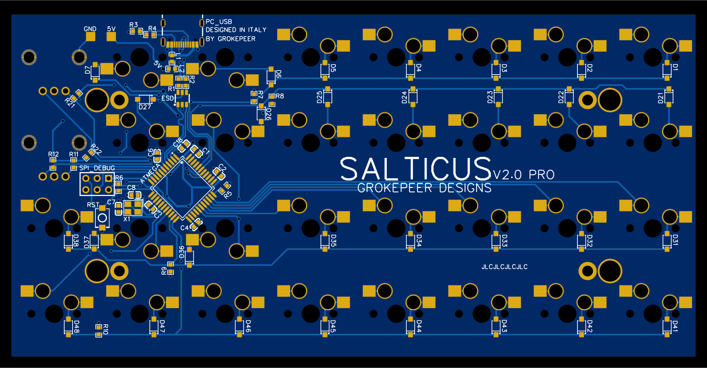
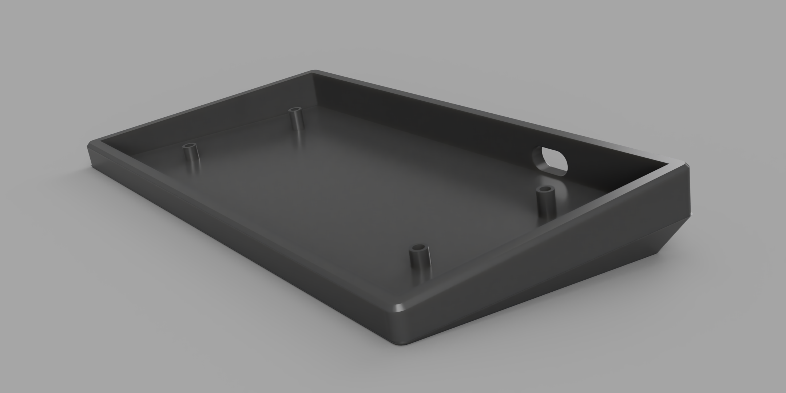
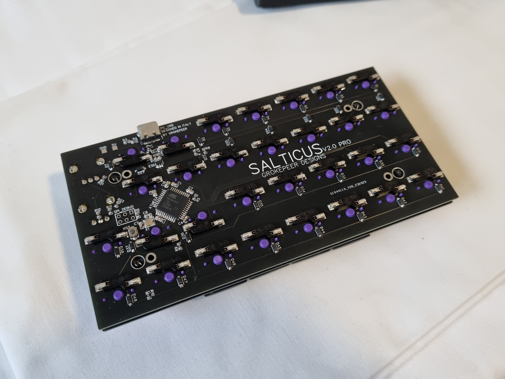
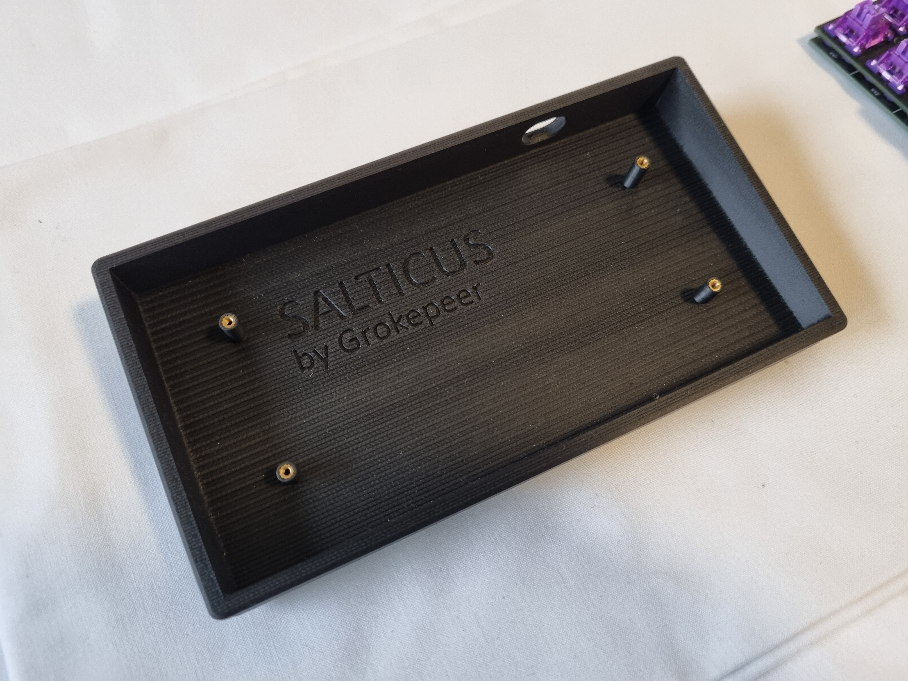

# Salticus

A compact keypad featuring 30 keys and 2 encoders, fully supporting QMK firmware to allow easy flashing of new firmware and over USB remapping of all keybinds.

## PCB 2D Renderings

## 3D Printable Case Rendering

## Pictures

